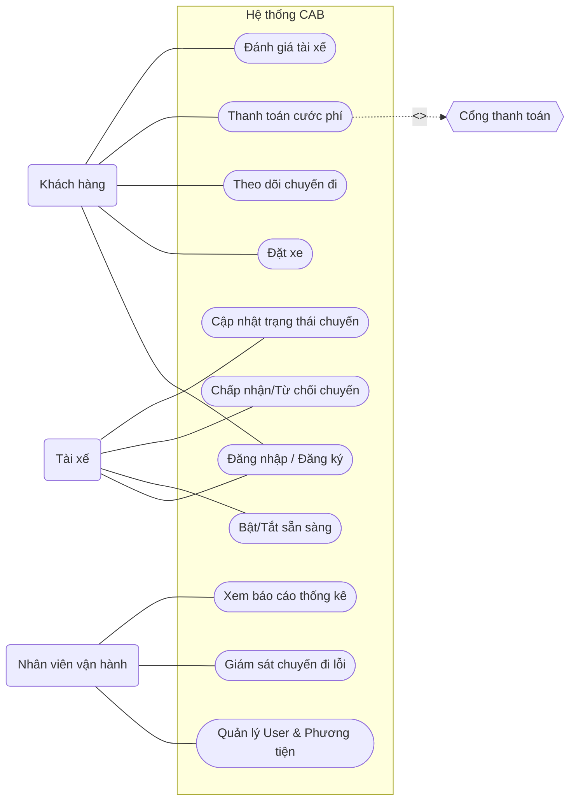

## bước 1:- đọc và phân tích yêu cầu: hiểuu về bussiness contesxt và bussiness problem  
       - trả lời câu hỏi: khách hàng muốn giải quyết vána đè gì
       - vì sao k thể đáp ứng, ai sử dụng ht này,
       - giá trị sau khi tạo ra

**1. Khách hàng muốn giải quyết vấn đề gì?**
Công ty ABC muốn xây dựng **CAB System** để tự động hóa và quản lý tập trung toàn bộ quy trình đặt xe: **đặt xe → tìm tài xế → thực hiện chuyến → tính cước → thanh toán → đánh giá**. 

**2. Vì sao hệ thống hiện tại không thể đáp ứng?**
* Phân công tài xế chủ yếu **thủ công**.
* Khách hàng khó **theo dõi trạng thái chuyến đi**.
* Thông tin **thanh toán chưa được quản lý tập trung**.
* Khó **mở rộng hệ thống** khi số lượng khách hàng và tài xế tăng. 

**3. Ai sử dụng hệ thống?**
* **Customer:** đặt xe, theo dõi chuyến, thanh toán, đánh giá.
* **Driver:** nhận/từ chối chuyến, cập nhật vị trí và trạng thái chuyến.
* **Operation Staff/Admin:** quản lý khách hàng, tài xế, phương tiện, chuyến đi và báo cáo. 

**4. Giá trị sau khi tạo ra hệ thống?**
* Tự động hóa quy trình đặt và điều phối xe.
* Cải thiện trải nghiệm Customer và Driver.
* Quản lý dữ liệu và hoạt động tập trung.
* Giảm khó khăn cho bộ phận vận hành.
* Có khả năng **scale và mở rộng tính năng** trong tương lai.

## bước 2: Xác định stakeholder trong dự án này
- lập bảng cột đầu stakeholder nào, cột 2 vai trò là gì
- vẽ ma trận stakeholder, cho biết mức độ ảnh hưởng của các vai trò trong hệ thống

Dựa trên yêu cầu của CAB System, các stakeholder chính gồm: 
| Stakeholder                 | Vai trò                                                               |
| --------------------------- | --------------------------------------------------------------------- |
| **Ban giám đốc ABC**        | Đưa ra mục tiêu, yêu cầu kinh doanh và định hướng phát triển hệ thống |
| **Customer**                | Đặt xe, theo dõi chuyến, thanh toán và đánh giá tài xế                |
| **Driver**                  | Nhận/từ chối chuyến, thực hiện chuyến và cập nhật trạng thái/vị trí   |
| **Operation Staff / Admin** | Quản lý khách hàng, tài xế, phương tiện, chuyến đi và xử lý sự cố     |
| **Business Analyst (BA)**   | Thu thập, phân tích và làm rõ yêu cầu với các bên liên quan           |
| **Development Team**        | Thiết kế, phát triển, tích hợp và triển khai CAB System               |
| **Payment Provider**        | Cung cấp dịch vụ xử lý thanh toán điện tử                             |
| **Notification Provider**   | Cung cấp kênh gửi thông báo cho Customer và Driver                    |

### Stakeholder Matrix

Có thể phân loại theo **Power (mức độ ảnh hưởng/quyền lực)** và **Interest (mức độ quan tâm đến hệ thống)**:

```text
                     POWER / INFLUENCE
                           HIGH
                            ↑
                            │
       KEEP SATISFIED       │        MANAGE CLOSELY
                            │
    Payment Provider        │    Ban giám đốc ABC
                            │    Operation Staff/Admin
                            │    BA
                            │    Development Team
                            │
LOW INTEREST ───────────────┼──────────────────── HIGH INTEREST
                            │
       MONITOR              │        KEEP INFORMED
                            │
 Notification Provider      │    Customer
                            │    Driver
                            │
                            ↓
                           LOW
```

### Mức độ ảnh hưởng

| Stakeholder               | Mức độ ảnh hưởng  | Lý do chính                                                        |
| ------------------------- | -----------------  | ------------------------------------------------------------------ |
| **Ban giám đốc ABC**      | 🔴 Cao            | Quyết định mục tiêu, phạm vi và yêu cầu kinh doanh                 |
| **Operation Staff/Admin** | 🔴 Cao            | Trực tiếp vận hành và quản lý hệ thống                             |
  | **BA**                  | 🔴 Cao            | Làm rõ requirement và kết nối stakeholder với Development Team     |
| **Development Team**      | 🔴 Cao            | Quyết định và triển khai giải pháp kỹ thuật                        |
| **Payment Provider**      | 🟠 Trung bình–Cao | Ảnh hưởng trực tiếp đến chức năng thanh toán điện tử               |
| **Customer**              | 🟠 Trung bình     | Người sử dụng chính, yêu cầu ảnh hưởng lớn đến chức năng đặt xe    |
| **Driver**                | 🟠 Trung bình     | Người trực tiếp tham gia Driver Matching và Trip                   |
| **Notification Provider** | 🟡 Trung bình     | Ảnh hưởng đến Notification nhưng không quyết định toàn bộ hệ thống |

## Bước 3:Tìm business goal
Business Goal là mục tiêu kinh doanh mà doanh nghiệp muốn đạt được khi xây dựng hệ thống.

| Business Goal                                | Mục tiêu cụ thể                                                                                   |
| -------------------------------------------- | ------------------------------------------------------------------------------------------------- |
| **BG1. Tự động hóa đặt xe**                  | Tự động tiếp nhận yêu cầu và tìm/phân công tài xế phù hợp thay cho việc phân công thủ công.       |
| **BG2. Nâng cao trải nghiệm khách hàng**     | Cho phép khách hàng đặt xe, theo dõi trạng thái, vị trí tài xế, thanh toán và đánh giá chuyến đi. |
| **BG3. Nâng cao hiệu quả vận hành**          | Giúp nhân viên quản lý tập trung khách hàng, tài xế, phương tiện và chuyến đi.                    |
| **BG4. Quản lý thanh toán tập trung**        | Quản lý cước và kết quả thanh toán, đồng thời tích hợp với nhà cung cấp thanh toán bên ngoài.     |
| **BG5. Tăng khả năng đáp ứng chuyến xe**     | Tự động tìm tài xế khác khi tài xế được đề xuất không phản hồi hoặc từ chối.                      |
| **BG6. Đảm bảo hệ thống ổn định và an toàn** | Đảm bảo hệ thống hoạt động khi tải cao, bảo vệ dữ liệu và kiểm soát quyền truy cập.               |
| **BG7. Hỗ trợ mở rộng trong tương lai**      | Dễ dàng bổ sung loại dịch vụ, phương thức thanh toán, kênh thông báo và các chức năng mới.        |
| **BG8. Hỗ trợ quản lý và ra quyết định**     | Cung cấp báo cáo về số chuyến, doanh thu, tỷ lệ hoàn thành, tỷ lệ hủy và hiệu quả tài xế.         |

## Bước 4: Xác định phạm vi scope
**1. In Scope – Những gì hệ thống sẽ thực hiện**
| Nhóm                     | Phạm vi                                                                                  |
| ------------------------ | ---------------------------------------------------------------------------------------- |
| **Quản lý tài khoản**    | Đăng ký, đăng nhập, cập nhật thông tin khách hàng và tài xế.                             |
| **Đặt xe**               | Nhập điểm đón, điểm đến, chọn loại xe và gửi yêu cầu đặt xe.                             |
| **Tìm tài xế**           | Tự động tìm tài xế dựa trên vị trí, trạng thái và tiêu chí vận hành.                     |
| **Phân công tài xế**     | Gửi yêu cầu cho tài xế, xử lý nhận/từ chối/không phản hồi và tìm tài xế tiếp theo.       |
| **Theo dõi chuyến**      | Theo dõi vị trí tài xế và trạng thái chuyến đi.                                          |
| **Thực hiện chuyến**     | Tài xế cập nhật: đến điểm đón → đón khách → đang di chuyển → hoàn thành.                 |
| **Tính cước**            | Tính số tiền khách hàng phải trả dựa trên thông tin chuyến và loại dịch vụ.              |
| **Thanh toán**           | Hỗ trợ tiền mặt và thanh toán điện tử thông qua nhà cung cấp bên ngoài.                  |
| **Thông báo**            | Thông báo cho khách hàng/tài xế về đặt xe, nhận chuyến, trạng thái chuyến và thanh toán. |
| **Đánh giá**             | Khách hàng đánh giá tài xế sau khi hoàn thành chuyến.                                    |
| **Quản lý vận hành**     | Nhân viên quản lý khách hàng, tài xế, phương tiện và chuyến đi.                          |
| **Báo cáo**              | Báo cáo số chuyến, doanh thu, tỷ lệ hoàn thành, tỷ lệ hủy và hiệu quả tài xế.            |
| **Phân quyền & bảo mật** | Xác thực, phân quyền và ghi log các thao tác quan trọng.                                 |

**2. Out of Scope – Chưa nằm trong phạm vi**

Do dự án chỉ có 7 tuần, nên một số nội dung có thể xác định là ngoài phạm vi giai đoạn đầu:
Tự xây dựng cổng thanh toán riêng → chỉ tích hợp nhà cung cấp bên ngoài.
Tự xây dựng hạ tầng bản đồ/GPS → sử dụng dịch vụ bản đồ bên ngoài.
Xây dựng hệ thống quản lý lương và chấm công tài xế.
Quản lý bảo dưỡng, sửa chữa phương tiện.
Quản lý kho phụ tùng hoặc nhiên liệu.
Các dịch vụ khác ngoài đặt xe nếu chưa được ABC yêu cầu.
Các tính năng nâng cao chưa được xác định trong giai đoạn phân tích.

## Bước 5: Chuyển đổi business requirement
Từ Business Goal + Scope, ta chuyển nhu cầu kinh doanh thành các Business Requirement (BR) cụ thể.
| **Business Goal**                         | **Business Requirement**                                                                                     | **Mục đích/giá trị**                                        |
| ----------------------------------------- | ------------------------------------------------------------------------------------------------------------ | ----------------------------------------------------------- |
| **BG1 – Tự động hóa đặt xe**              | **BR01:** Hệ thống cho phép khách hàng tạo yêu cầu đặt xe.                                                   | Giúp khách hàng đặt xe nhanh chóng, giảm thao tác thủ công. |
| **BG1 – Tự động hóa đặt xe**              | **BR02:** Hệ thống tự động tìm và phân công tài xế phù hợp.                                                  | Giảm thời gian tìm tài xế và nâng cao hiệu quả vận hành.    |
| **BG1 – Tự động hóa đặt xe**              | **BR03:** Hệ thống tiếp tục tìm tài xế khác khi tài xế từ chối hoặc không phản hồi.                          | Tăng khả năng tìm được tài xế cho khách hàng.               |
| **BG2 – Nâng cao trải nghiệm khách hàng** | **BR04:** Hệ thống cho phép khách hàng theo dõi trạng thái và vị trí chuyến đi.                              | Khách hàng chủ động nắm được tình trạng chuyến xe.          |
| **BG2 – Nâng cao trải nghiệm khách hàng** | **BR05:** Hệ thống cho phép khách hàng xem lịch sử và đánh giá tài xế.                                       | Nâng cao trải nghiệm và chất lượng dịch vụ.                 |
| **BG3 – Nâng cao hiệu quả vận hành**      | **BR06:** Hệ thống cho phép nhân viên quản lý khách hàng, tài xế, phương tiện và chuyến đi.                  | Quản lý tập trung, giảm công việc thủ công.                 |
| **BG4 – Quản lý thanh toán**              | **BR07:** Hệ thống tính cước và hỗ trợ thanh toán tiền mặt hoặc điện tử.                                     | Quản lý doanh thu và thanh toán thuận tiện.                 |
| **BG5 – Tăng khả năng đáp ứng chuyến**    | **BR08:** Hệ thống lưu vị trí và trạng thái hoạt động của tài xế.                                            | Hỗ trợ tìm tài xế gần khách hàng và rút ngắn thời gian chờ. |
| **BG6 – Ổn định và bảo mật**              | **BR09:** Hệ thống xác thực, phân quyền và bảo vệ dữ liệu người dùng.                                        | Đảm bảo an toàn và bảo mật thông tin.                       |
| **BG7 – Khả năng mở rộng**                | **BR10:** Hệ thống cho phép tích hợp thêm dịch vụ, phương thức thanh toán và kênh thông báo.                 | Giúp hệ thống dễ phát triển trong tương lai.                |
| **BG8 – Hỗ trợ ra quyết định**            | **BR11:** Hệ thống cung cấp báo cáo về số chuyến, doanh thu, tỷ lệ hoàn thành, tỷ lệ hủy và hiệu quả tài xế. | Giúp ban lãnh đạo theo dõi và ra quyết định.                |

## Bước 6: Business Process

| Bước   | Business Process                                               | Người thực hiện             |
| ------ | -------------------------------------------------------------- | --------------------------- |
| **1**  | Khách hàng đăng nhập và nhập **điểm đón, điểm đến, loại xe**   | Khách hàng                  |
| **2**  | Khách hàng **gửi yêu cầu đặt xe**                              | Khách hàng                  |
| **3**  | Hệ thống **tiếp nhận yêu cầu và tìm tài xế phù hợp**           | Hệ thống                    |
| **4**  | Hệ thống gửi yêu cầu cho tài xế                                | Hệ thống                    |
| **5**  | Tài xế **chấp nhận hoặc từ chối** chuyến                       | Tài xế                      |
| **6**  | Nếu từ chối/không phản hồi → hệ thống **tìm tài xế khác**      | Hệ thống                    |
| **7**  | Tài xế đến điểm đón và **cập nhật trạng thái**                 | Tài xế                      |
| **8**  | Tài xế đón khách và **thực hiện chuyến đi**                    | Tài xế                      |
| **9**  | Tài xế hoàn thành chuyến → hệ thống **tính cước**              | Tài xế + Hệ thống           |
| **10** | Khách hàng **thanh toán** bằng tiền mặt hoặc điện tử           | Khách hàng                  |
| **11** | Hệ thống gửi thông báo kết quả thanh toán                      | Hệ thống                    |
| **12** | Khách hàng **đánh giá tài xế**                                 | Khách hàng                  |
| **13** | Dữ liệu chuyến đi được **lưu vào hệ thống và phục vụ báo cáo** | Hệ thống/Nhân viên vận hành |

dùng công cụ mermaid để vẽ sơ đồ

## Bước 7: Viết phân rã yêu cầu chức năng (functional requirement decomposition)

| Mã       | Yêu cầu chức năng                                              |
| -------- | -------------------------------------------------------------- |
| **FR01** | Kiểm tra tài xế đang sẵn sàng nhận chuyến                      |
| **FR02** | Tìm tài xế phù hợp và gần điểm đón                             |
| **FR03** | Gửi yêu cầu nhận chuyến cho tài xế                             |
| **FR04** | Cho phép tài xế chấp nhận hoặc từ chối chuyến                  |
| **FR05** | Tự động tìm tài xế khác khi tài xế từ chối hoặc không phản hồi |
| **FR06** | Thông báo cho khách hàng khi tài xế được phân công             |
| **FR07** | Theo dõi vị trí hiện tại của tài xế                            |
| **FR08** | Theo dõi trạng thái chuyến đi                                  |
| **FR09** | Cho phép tài xế cập nhật trạng thái chuyến                     |
| **FR10** | Tính cước chuyến đi                                            |
| **FR11** | Hỗ trợ thanh toán tiền mặt                                     |
| **FR12** | Hỗ trợ thanh toán điện tử                                      |
| **FR13** | Xử lý và thông báo khi thanh toán thất bại                     |
| **FR14** | Gửi thông báo cho khách hàng và tài xế                         |
| **FR15** | Lưu và xem lịch sử chuyến đi                                   |
| **FR16** | Cho phép khách hàng đánh giá tài xế                            |
| **FR17** | Quản lý thông tin khách hàng                                   |
| **FR18** | Quản lý thông tin tài xế                                       |
| **FR19** | Quản lý thông tin phương tiện                                  |
| **FR20** | Quản lý và theo dõi các chuyến đi                              |
| **FR21** | Tra cứu lịch sử giao dịch                                      |
| **FR22** | Xử lý các chuyến đi bị lỗi                                     |
| **FR23** | Phân quyền người sử dụng hệ thống                              |
| **FR24** | Ghi nhận nhật ký các thao tác quan trọng                       |
| **FR25** | Cung cấp báo cáo và thống kê hoạt động                         |

## Bước 8: Quy tắc nghiệp (Business Rules) vụ và ngoại lệ (Exception)


(Business Rules)

| Mã       | Quy tắc nghiệp vụ                                                                                           |
| -------- | ----------------------------------------------------------------------------------------------------------- |
| **BR01** | Khách hàng phải **đăng nhập** trước khi đặt xe.                                                             |
| **BR02** | Tài xế chỉ được nhận chuyến khi ở trạng thái **sẵn sàng**.                                                  |
| **BR03** | Hệ thống ưu tiên tài xế **phù hợp và gần điểm đón**.                                                        |
| **BR04** | Tài xế có quyền **chấp nhận hoặc từ chối** chuyến được gửi đến.                                             |
| **BR05** | Nếu tài xế từ chối hoặc không phản hồi trong thời gian quy định, hệ thống phải **tìm tài xế khác**.         |
| **BR06** | Một chuyến xe chỉ được **gán cho một tài xế** tại một thời điểm.                                            |
| **BR07** | Tài xế phải cập nhật đúng trạng thái: **Đã đến → Đã đón khách → Đang di chuyển → Hoàn thành**.              |
| **BR08** | Cước chuyến xe được tính dựa trên **loại dịch vụ và thông tin chuyến đi** theo chính sách của doanh nghiệp. |
| **BR09** | Khách hàng có thể thanh toán bằng **tiền mặt hoặc thanh toán điện tử**.                                     |
| **BR10** | Thông tin thanh toán nhạy cảm **không được lưu trực tiếp** trên hệ thống CAB.                               |
| **BR11** | Khách hàng chỉ được đánh giá tài xế **sau khi chuyến đi hoàn thành**.                                       |
| **BR12** | Chỉ nhân viên có **đúng quyền hạn** mới được thực hiện các thao tác quản trị nhạy cảm.                      |
| **BR13** | Các thao tác quan trọng phải được **ghi nhật ký** để phục vụ kiểm tra.                                      |
| **BR14** | Dữ liệu cá nhân, vị trí và giao dịch phải được **bảo vệ** theo chính sách bảo mật của doanh nghiệp.         |


(Exception)

| Mã       | Ngoại lệ                                     | Cách xử lý                                                                                |
| -------- | -------------------------------------------- | ----------------------------------------------------------------------------------------- |
| **EX01** | Không tìm được tài xế                        | Thông báo cho khách hàng và kết thúc yêu cầu đặt xe.                                      |
| **EX02** | Tài xế từ chối chuyến                        | Hệ thống tự động tìm tài xế khác.                                                         |
| **EX03** | Tài xế không phản hồi                        | Sau thời gian quy định, hệ thống chuyển sang tìm tài xế khác.                             |
| **EX04** | Thanh toán điện tử thất bại                  | Thông báo cho khách hàng và cho phép thực hiện thanh toán lại theo chính sách.            |
| **EX05** | Mất kết nối mạng                             | Hệ thống lưu/đồng bộ lại dữ liệu khi có kết nối; không làm mất trạng thái chuyến.         |
| **EX06** | Tài xế mất kết nối khi đang thực hiện chuyến | Hệ thống ghi nhận trạng thái cuối cùng và thông báo cho bộ phận vận hành xử lý.           |
| **EX07** | Hệ thống thông báo gặp lỗi                   | Thử gửi lại hoặc chuyển sang kênh thông báo khác nếu có. Không làm dừng quy trình đặt xe. |
| **EX08** | Dịch vụ thanh toán bên ngoài không hoạt động | Thông báo lỗi và cho phép khách hàng sử dụng phương thức thanh toán khác theo chính sách. |
| **EX09** | Tài xế không còn sẵn sàng sau khi được chọn  | Hủy phân công và tiếp tục tìm tài xế khác.                                                |
| **EX10** | Người dùng không có quyền truy cập chức năng | Từ chối thao tác và thông báo không đủ quyền.                                             |

## Bước 9: Mô hình hóa dữ liệu (data modeling)
Dựa trên yêu cầu hiện tại, các *Business Entity* chính của CAB System có thể xác định như sau. 

| Entity           | Dữ liệu chính                                                           |
| ---------------- | ----------------------------------------------------------------------- |
| *Customer*     | CustomerID, Name, Phone, Email, Profile                                 |
| *Driver*       | DriverID, Name, Phone, Status, CurrentLocation                          |
| *Vehicle*      | VehicleID, DriverID, VehicleType, PlateNumber, VehicleInfo              |
| *Booking*      | BookingID, CustomerID, PickupLocation, Destination, ServiceType, Status |
| *Trip*         | TripID, BookingID, DriverID, StartTime, EndTime, TripStatus             |
| *Location*     | LocationID, DriverID, Latitude, Longitude, Timestamp                    |
| *Fare*         | FareID, TripID, Amount, ServiceType                                     |
| *Payment*      | PaymentID, TripID, Method, Amount, PaymentStatus                        |
| *Rating*       | RatingID, TripID, CustomerID, DriverID, Score, Comment                  |
| *Notification* | NotificationID, UserID, Type, Content, Status                           |
| *Transaction*  | TransactionID, PaymentID, Amount, Status, CreatedAt                     |
| *AuditLog*     | LogID, UserID, Action, Timestamp                                        |

### Quan hệ dữ liệu chính

text
Customer
   │
   └── creates ──> Booking
                     │
                     └── generates ──> Trip
                                        │
Driver ───────────────┘                 │
   │                                    ├── Fare
   ├── Vehicle                          ├── Payment
   └── Location                         └── Rating

Payment ──> Transaction

Customer / Driver
       │
       └── Notification

User/Admin
       │
       └── AuditLog

# Bước 10. Xác định yêu cầu không phải chức năng (Non-Functional Requirements)

| Mã        | Nhóm                           | Yêu cầu phi chức năng                                                                                                            |
| --------- | ------------------------------ | -------------------------------------------------------------------------------------------------------------------------------- |
| **NFR01** | **Hiệu năng**                  | Hệ thống phải phản hồi nhanh khi khách hàng đặt xe và tìm tài xế.                                                                |
| **NFR02** | **Khả năng chịu tải**          | Hệ thống phải hoạt động ổn định khi số lượng khách hàng và tài xế tăng cao.                                                      |
| **NFR03** | **Khả năng mở rộng**           | Các thành phần như tìm tài xế, thanh toán, thông báo có thể mở rộng độc lập khi tải tăng.                                        |
| **NFR04** | **Tính sẵn sàng**              | Lỗi ở một thành phần như thanh toán hoặc thông báo không được làm toàn bộ hệ thống đặt xe ngừng hoạt động.                       |
| **NFR05** | **Bảo mật**                    | Hệ thống phải xác thực người dùng trước khi sử dụng các chức năng yêu cầu tài khoản.                                             |
| **NFR06** | **Phân quyền**                 | Chỉ người dùng có quyền phù hợp mới được thực hiện các chức năng quản trị hoặc thao tác nhạy cảm.                                |
| **NFR07** | **Bảo vệ dữ liệu**             | Thông tin cá nhân, thông tin phương tiện, dữ liệu vị trí và dữ liệu giao dịch phải được bảo vệ.                                  |
| **NFR08** | **Audit/Logging**              | Hệ thống phải ghi lại các thao tác quan trọng để phục vụ kiểm tra và xử lý sự cố.                                                |
| **NFR09** | **Khả năng tích hợp**          | Hệ thống phải có khả năng tích hợp với nhà cung cấp thanh toán và các dịch vụ thông báo bên ngoài.                               |
| **NFR10** | **Khả năng bảo trì**           | Hệ thống phải được thiết kế theo các thành phần độc lập để có thể thay đổi hoặc nâng cấp từng phần.                              |
| **NFR11** | **Khả năng mở rộng chức năng** | Có thể bổ sung loại dịch vụ, phương thức thanh toán hoặc nhà cung cấp thông báo mới mà không phải xây dựng lại toàn bộ hệ thống. |
| **NFR12** | **Khôi phục lỗi**              | Hệ thống phải có cơ chế xử lý và khôi phục khi xảy ra lỗi mạng, thanh toán hoặc dịch vụ bên ngoài.                               |

## Bước 11: Tiến hành thiết kế các use case (UC)

## Bước 12: Đặc tả use case 
UC01-ĐẶT XE
| Thành phần         | Nội dung                                                                                                                                                                                                                          |
| ------------------ | --------------------------------------------------------------------------------------------------------------------------------------------------------------------------------------------------------------------------------- |
| **Mã Use Case**    | UC01                                                                                                                                                                                                                              |
| **Tên Use Case**   | Đặt xe                                                                                                                                                                                                                            |
| **Actor chính**    | Khách hàng                                                                                                                                                                                                                        |
| **Mục tiêu**       | Cho phép khách hàng tạo yêu cầu đặt xe.                                                                                                                                                                                           |
| **Tiền điều kiện** | Khách hàng đã đăng nhập.                                                                                                                                                                                                          |
| **Hậu điều kiện**  | Yêu cầu đặt xe được tạo và hệ thống bắt đầu tìm tài xế.                                                                                                                                                                           |
| **Luồng chính**    | 1. Khách hàng chọn chức năng Đặt xe.<br>2. Nhập điểm đón.<br>3. Nhập điểm đến.<br>4. Chọn loại xe.<br>5. Xác nhận yêu cầu.<br>6. Hệ thống lưu yêu cầu.<br>7. Hệ thống tìm tài xế phù hợp.<br>8. Thông báo kết quả cho khách hàng. |
| **Ngoại lệ**       | Không tìm được tài xế → hệ thống thông báo cho khách hàng.                                                                                                                                                                        |
UC02 – Tìm tài xế sẵn có
| Thành phần         | Nội dung                                                                                                                                                                                                                                                                                 |
| ------------------ | ---------------------------------------------------------------------------------------------------------------------------------------------------------------------------------------------------------------------------------------------------------------------------------------- |
| **Mã Use Case**    | UC02                                                                                                                                                                                                                                                                                     |
| **Tên Use Case**   | Tìm tài xế sẵn có                                                                                                                                                                                                                                                                        |
| **Actor chính**    | Hệ thống                                                                                                                                                                                                                                                                                 |
| **Actor phụ**      | Tài xế                                                                                                                                                                                                                                                                                   |
| **Mục tiêu**       | Tìm tài xế phù hợp để thực hiện chuyến xe.                                                                                                                                                                                                                                               |
| **Tiền điều kiện** | Có yêu cầu đặt xe hợp lệ.                                                                                                                                                                                                                                                                |
| **Hậu điều kiện**  | Một tài xế được phân công hoặc thông báo không tìm được tài xế.                                                                                                                                                                                                                          |
| **Luồng chính**    | 1. Hệ thống nhận yêu cầu đặt xe.<br>2. Kiểm tra các tài xế đang sẵn sàng.<br>3. Kiểm tra vị trí tài xế.<br>4. Lọc tài xế phù hợp với loại xe.<br>5. Ưu tiên tài xế gần khách hàng.<br>6. Gửi yêu cầu nhận chuyến.<br>7. Tài xế chấp nhận.<br>8. Hệ thống xác nhận tài xế cho khách hàng. |
| **Ngoại lệ**       | Tài xế từ chối/không phản hồi → hệ thống tìm tài xế khác.<br>Không còn tài xế phù hợp → thông báo khách hàng.                                                                                                                                                                            |
UC03 – Chấp nhận/Từ chối chuyến
| Thành phần         | Nội dung                                                                                                                                                   |
| ------------------ | ---------------------------------------------------------------------------------------------------------------------------------------------------------- |
| **Mã Use Case**    | UC03                                                                                                                                                       |
| **Tên Use Case**   | Chấp nhận/Từ chối chuyến                                                                                                                                   |
| **Actor chính**    | Tài xế                                                                                                                                                     |
| **Tiền điều kiện** | Tài xế đang ở trạng thái sẵn sàng và nhận được yêu cầu chuyến.                                                                                             |
| **Hậu điều kiện**  | Chuyến được tài xế nhận hoặc hệ thống tìm tài xế khác.                                                                                                     |
| **Luồng chính**    | 1. Tài xế nhận thông báo chuyến mới.<br>2. Xem thông tin chuyến.<br>3. Chọn **Chấp nhận**.<br>4. Hệ thống xác nhận tài xế.<br>5. Thông báo cho khách hàng. |
| **Ngoại lệ**       | Tài xế chọn **Từ chối** → hệ thống tiếp tục tìm tài xế khác.                                                                                               |

UC04 – Theo dõi chuyến đi
| Thành phần         | Nội dung                                                                                                                                                       |
| ------------------ | -------------------------------------------------------------------------------------------------------------------------------------------------------------- |
| **Mã Use Case**    | UC04                                                                                                                                                           |
| **Tên Use Case**   | Theo dõi chuyến đi                                                                                                                                             |
| **Actor chính**    | Khách hàng                                                                                                                                                     |
| **Tiền điều kiện** | Khách hàng đã có chuyến được tài xế nhận.                                                                                                                      |
| **Hậu điều kiện**  | Khách hàng biết được vị trí và trạng thái hiện tại của chuyến.                                                                                                 |
| **Luồng chính**    | 1. Khách hàng mở chuyến đang thực hiện.<br>2. Hệ thống hiển thị vị trí tài xế.<br>3. Hiển thị trạng thái chuyến.<br>4. Cập nhật thông tin theo thời gian thực. |
| **Ngoại lệ**       | Mất kết nối → hiển thị thông tin cập nhật gần nhất và đồng bộ lại khi có kết nối.                                                                              |

UC05 – Cập nhật trạng thái chuyến
| Thành phần         | Nội dung                                                                                                                                                                                                                                            |
| ------------------ | --------------------------------------------------------------------------------------------------------------------------------------------------------------------------------------------------------------------------------------------------- |
| **Mã Use Case**    | UC05                                                                                                                                                                                                                                                |
| **Tên Use Case**   | Cập nhật trạng thái chuyến                                                                                                                                                                                                                          |
| **Actor chính**    | Tài xế                                                                                                                                                                                                                                              |
| **Tiền điều kiện** | Tài xế đã nhận chuyến.                                                                                                                                                                                                                              |
| **Hậu điều kiện**  | Trạng thái chuyến được cập nhật.                                                                                                                                                                                                                    |
| **Luồng chính**    | 1. Tài xế đến điểm đón → cập nhật **Đã đến**.<br>2. Đón khách → cập nhật **Đã đón khách**.<br>3. Bắt đầu di chuyển → cập nhật **Đang di chuyển**.<br>4. Đến điểm đến → cập nhật **Hoàn thành**.<br>5. Hệ thống thông báo trạng thái cho khách hàng. |

UC06 – Thanh toán cước phí
| Thành phần         | Nội dung                                                                                                                                                                                                                                                                                                      |
| ------------------ | ------------------------------------------------------------------------------------------------------------------------------------------------------------------------------------------------------------------------------------------------------------------------------------------------------------- |
| **Mã Use Case**    | UC06                                                                                                                                                                                                                                                                                                          |
| **Tên Use Case**   | Thanh toán cước phí                                                                                                                                                                                                                                                                                           |
| **Actor chính**    | Khách hàng                                                                                                                                                                                                                                                                                                    |
| **Actor phụ**      | Cổng thanh toán                                                                                                                                                                                                                                                                                               |
| **Tiền điều kiện** | Chuyến xe đã hoàn thành và hệ thống đã tính cước.                                                                                                                                                                                                                                                             |
| **Hậu điều kiện**  | Giao dịch được ghi nhận thành công hoặc thất bại.                                                                                                                                                                                                                                                             |
| **Luồng chính**    | 1. Hệ thống hiển thị số tiền cần thanh toán.<br>2. Khách hàng chọn phương thức thanh toán.<br>3. Nếu tiền mặt → xác nhận thanh toán.<br>4. Nếu điện tử → chuyển đến cổng thanh toán.<br>5. Cổng thanh toán trả kết quả.<br>6. Hệ thống cập nhật trạng thái giao dịch.<br>7. Thông báo kết quả cho khách hàng. |
| **Ngoại lệ**       | Thanh toán điện tử thất bại → thông báo lỗi và cho phép thanh toán lại theo chính sách.                                                                                                                                                                                                                       |


UC07 – Đánh giá tài xế
| Thành phần         | Nội dung                                                                                                                                                                    |
| ------------------ | --------------------------------------------------------------------------------------------------------------------------------------------------------------------------- |
| **Mã Use Case**    | UC07                                                                                                                                                                        |
| **Tên Use Case**   | Đánh giá tài xế                                                                                                                                                             |
| **Actor chính**    | Khách hàng                                                                                                                                                                  |
| **Tiền điều kiện** | Chuyến xe đã hoàn thành.                                                                                                                                                    |
| **Hậu điều kiện**  | Đánh giá được lưu vào hệ thống.                                                                                                                                             |
| **Luồng chính**    | 1. Khách hàng mở lịch sử chuyến.<br>2. Chọn chuyến đã hoàn thành.<br>3. Chọn số điểm đánh giá.<br>4. Nhập nhận xét nếu có.<br>5. Gửi đánh giá.<br>6. Hệ thống lưu đánh giá. |
| **Ngoại lệ**       | Khách hàng chưa hoàn thành chuyến → không được đánh giá.                                                                                                                    |

UC08 – Quản lý chuyến đi
| Thành phần         | Nội dung                                                                                                                                                                                 |
| ------------------ | ---------------------------------------------------------------------------------------------------------------------------------------------------------------------------------------- |
| **Mã Use Case**    | UC08                                                                                                                                                                                     |
| **Tên Use Case**   | Quản lý chuyến đi                                                                                                                                                                        |
| **Actor chính**    | Nhân viên vận hành                                                                                                                                                                       |
| **Tiền điều kiện** | Nhân viên đã đăng nhập và có quyền quản lý.                                                                                                                                              |
| **Hậu điều kiện**  | Thông tin chuyến được xem hoặc xử lý.                                                                                                                                                    |
| **Luồng chính**    | 1. Nhân viên mở danh sách chuyến.<br>2. Tìm kiếm/lọc chuyến.<br>3. Xem chi tiết chuyến.<br>4. Theo dõi trạng thái chuyến.<br>5. Xử lý chuyến có vấn đề nếu cần.<br>6. Lưu kết quả xử lý. |

UC09 – Xem báo cáo thống kê
| Thành phần         | Nội dung                                                                                                                                                                         |
| ------------------ | -------------------------------------------------------------------------------------------------------------------------------------------------------------------------------- |
| **Mã Use Case**    | UC09                                                                                                                                                                             |
| **Tên Use Case**   | Xem báo cáo thống kê                                                                                                                                                             |
| **Actor chính**    | Ban giám đốc                                                                                                                                                                     |
| **Tiền điều kiện** | Người dùng có quyền xem báo cáo.                                                                                                                                                 |
| **Hậu điều kiện**  | Báo cáo được hiển thị.                                                                                                                                                           |
| **Luồng chính**    | 1. Ban giám đốc chọn Báo cáo.<br>2. Chọn khoảng thời gian.<br>3. Hệ thống tổng hợp dữ liệu.<br>4. Hiển thị số chuyến, doanh thu, tỷ lệ hoàn thành, tỷ lệ hủy và hiệu quả tài xế. |


## Bước 13: Acception tiêu chí chấp nhận AC
| Mã       | Chức năng           | Acceptance Criteria                                                                                                    |
| -------- | ------------------- | ---------------------------------------------------------------------------------------------------------------------- |
| **AC01** | Đăng ký / Đăng nhập | Người dùng nhập đúng thông tin thì đăng nhập thành công; thông tin sai phải hiển thị thông báo lỗi.                    |
| **AC02** | Đặt xe              | Khách hàng nhập đầy đủ điểm đón, điểm đến và loại xe thì hệ thống tạo được yêu cầu đặt xe.                             |
| **AC03** | Tìm tài xế          | Hệ thống chỉ tìm các tài xế đang **sẵn sàng**, phù hợp loại xe và ưu tiên tài xế gần điểm đón.                         |
| **AC04** | Phân công tài xế    | Khi tài xế chấp nhận, hệ thống phải xác nhận tài xế cho chuyến và thông báo cho khách hàng.                            |
| **AC05** | Tài xế từ chối      | Khi tài xế từ chối hoặc không phản hồi, hệ thống phải tự động tìm tài xế khác mà khách hàng không cần đặt lại.         |
| **AC06** | Theo dõi chuyến     | Khách hàng phải xem được tài xế, vị trí và trạng thái hiện tại của chuyến.                                             |
| **AC07** | Cập nhật chuyến     | Tài xế phải cập nhật được các trạng thái: **Đã đến → Đã đón khách → Đang di chuyển → Hoàn thành**.                     |
| **AC08** | Tính cước           | Sau khi chuyến hoàn thành, hệ thống phải tính và hiển thị số tiền khách hàng cần thanh toán.                           |
| **AC09** | Thanh toán          | Hệ thống phải hỗ trợ tiền mặt và thanh toán điện tử; giao dịch điện tử phải trả về trạng thái thành công/thất bại.     |
| **AC10** | Thanh toán thất bại | Khi thanh toán điện tử thất bại, hệ thống phải thông báo lỗi và cho phép khách hàng thực hiện lại theo chính sách.     |
| **AC11** | Thông báo           | Khách hàng và tài xế phải nhận được thông báo khi xảy ra các sự kiện quan trọng của chuyến.                            |
| **AC12** | Đánh giá            | Chỉ khách hàng có chuyến đã hoàn thành mới được đánh giá tài xế.                                                       |
| **AC13** | Quản lý vận hành    | Nhân viên có quyền phải xem và quản lý được khách hàng, tài xế, phương tiện và chuyến đi.                              |
| **AC14** | Phân quyền          | Người dùng không có quyền phải bị từ chối khi truy cập chức năng quản trị.                                             |
| **AC15** | Báo cáo             | Ban giám đốc phải xem được số chuyến, doanh thu, tỷ lệ hoàn thành, tỷ lệ hủy và hiệu quả tài xế.                       |
| **AC16** | Bảo mật             | Người dùng phải được xác thực trước khi truy cập các chức năng yêu cầu tài khoản và dữ liệu nhạy cảm phải được bảo vệ. |

## Bước 14: Truy xuất nguồn gốc yêu cầu
| Business Goal                  | Business Requirement               | Functional Requirement                                  | Use Case                              | Acceptance Criteria                                              |
| ------------------------------ | ---------------------------------- | ------------------------------------------------------- | ------------------------------------- | ---------------------------------------------------------------- |
| **BG1 – Tự động hóa đặt xe**   | BR01 – Cho phép khách hàng đặt xe  | **FR01 – Tạo yêu cầu đặt xe**                           | **UC01 – Đặt xe**                     | **AC01 – Tạo yêu cầu thành công khi nhập đủ thông tin**          |
| **BG1 – Tự động hóa đặt xe**   | BR02 – Tự động tìm tài xế          | **FR02 – Tìm tài xế sẵn có**                            | **UC02 – Tìm tài xế**                 | **AC02 – Chỉ tìm tài xế phù hợp và sẵn sàng**                    |
| **BG1 – Tự động hóa đặt xe**   | BR03 – Tìm tài xế khác khi từ chối | **FR03 – Tìm tài xế thay thế**                          | **UC03 – Chấp nhận/Từ chối chuyến**   | **AC03 – Tự động tìm tài xế khác khi bị từ chối/không phản hồi** |
| **BG2 – Nâng cao trải nghiệm** | BR04 – Cho phép theo dõi chuyến    | **FR04 – Theo dõi chuyến đi**                           | **UC04 – Theo dõi chuyến**            | **AC04 – Hiển thị vị trí và trạng thái chuyến**                  |
| **BG2 – Nâng cao trải nghiệm** | BR05 – Cập nhật trạng thái chuyến  | **FR05 – Cập nhật trạng thái**                          | **UC05 – Cập nhật trạng thái chuyến** | **AC05 – Cập nhật đúng các trạng thái chuyến**                   |
| **BG4 – Quản lý thanh toán**   | BR06 – Tính và thanh toán cước     | **FR06 – Tính cước**                                    | **UC06 – Thanh toán cước**            | **AC06 – Hiển thị đúng số tiền cần thanh toán**                  |
| **BG4 – Quản lý thanh toán**   | BR07 – Hỗ trợ thanh toán điện tử   | **FR07 – Thanh toán điện tử**                           | **UC06 – Thanh toán cước**            | **AC07 – Ghi nhận thành công/thất bại giao dịch**                |
| **BG2 – Nâng cao trải nghiệm** | BR08 – Gửi thông báo               | **FR08 – Gửi thông báo**                                | **UC07 – Gửi thông báo**              | **AC08 – Gửi thông báo khi có sự kiện quan trọng**               |
| **BG2 – Nâng cao trải nghiệm** | BR09 – Cho phép đánh giá           | **FR09 – Đánh giá tài xế**                              | **UC08 – Đánh giá tài xế**            | **AC09 – Chỉ đánh giá được sau khi chuyến hoàn thành**           |
| **BG3 – Nâng cao vận hành**    | BR10 – Quản lý dữ liệu vận hành    | **FR10 – Quản lý khách hàng/tài xế/phương tiện/chuyến** | **UC09 – Quản lý vận hành**           | **AC10 – Nhân viên có quyền có thể xem và quản lý dữ liệu**      |
| **BG8 – Hỗ trợ ra quyết định** | BR11 – Cung cấp báo cáo            | **FR11 – Báo cáo thống kê**                             | **UC10 – Xem báo cáo**                | **AC11 – Hiển thị đầy đủ các chỉ số yêu cầu**                    |
| **BG6 – Bảo mật**              | BR12 – Kiểm soát truy cập          | **FR12 – Phân quyền**                                   | **UC11 – Quản lý phân quyền**         | **AC12 – Người không có quyền không thể truy cập**               |


